# Kasa – Application de location immobilière (React + Next.js)


## Description
Kasa est une application web de location d’appartements et de maisons entre particuliers.
Ce projet consiste à développer la **refonte complète du front-end** du site en **Next.js**, à partir de maquettes Figma fournies, en consommant une API existante.

---

## Objectifs du projet (sprint 1)
- Démarrer une application React avec Next.js (TypeScript)
- Développer une application front-end complète, responsive, performante, accessible et SEO
- Créer des composants réutilisables
- Implémenter des animations et interactions (Gallery, Collapse, Caroussel)
- Gestion de favoris
- Mettre en place des tests unitaires

---

## Technologies utilisées
- React
- Next.js
- TypeScript
- Tailwind CSS (postcss)
- Tests unitaires (Vitest)

---

## Installation et lancement

### 1. Cloner le repository

Exécuter : 
`````git clone https://github.com/Kran67/kasa.git`````

### 2. se placer dans le dossier racine

Exécuter : 
`````npm i`````

### 3. Configuration de l'adresse de l'api
Créer un fichier .env à la racine du site et mettre à l'intérieur la constante suivante :
- NEXT_PUBLIC_API_BASE_URL = http://localhost:3000 (où localhost:3000 est l'url de l'api)

### 4. Lancer le projet

Exécuter : 
`````npm run dev`````

L'application sera accessible sur http://localhost:3000 par défaut (le port peut changer si celui-ci est déjà utilisé).

## Api du back-end
Elle est disponible à cette adresse : https://github.com/OpenClassrooms-Student-Center/dev-react-P12


## Maquettes Figma
https://www.figma.com/design/UEw5iG40U3V0NeqBr91rd9/KASA-NEW?t=mCFOXmLy3OOMsN9x-0

## Tests unitaires

Exécuter : 
`````npm run test`````

Résultat :
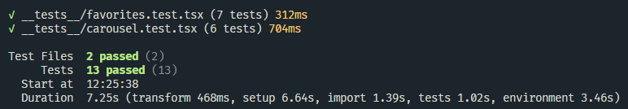

---

## Performance et accessibilité

Lighthouse
| Page |Result|
| --- |------|
| Accueil | 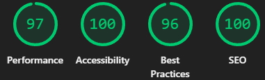 |
| À propos | 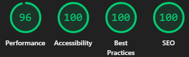 |
| Propriété | 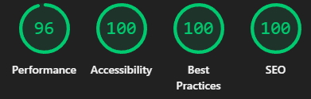 |
| Favoris | 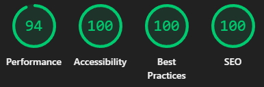 |
| Messagerie | 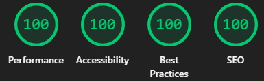 |
| Connexion | 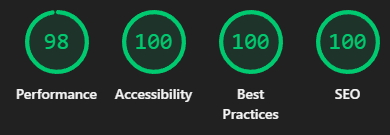 |
| Inscription | 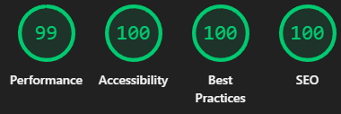 |

WAVE
| Page |Result|
| --- |------|
| Accueil | 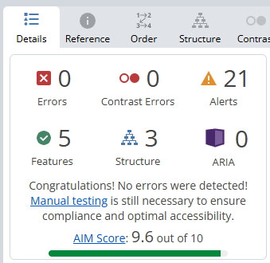 |
| À propos | 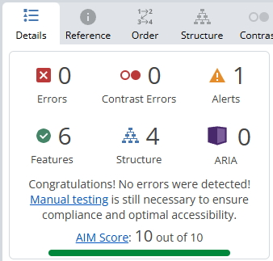 |
| Propriété | 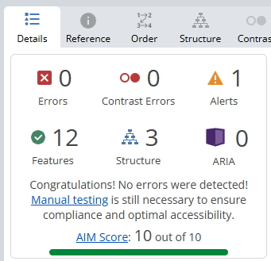 |
| Favoris | 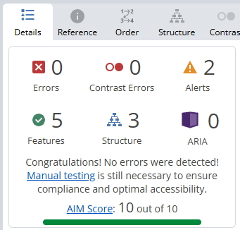 |
| Messagerie | 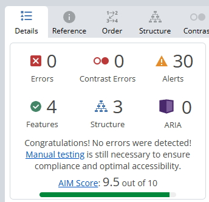 |
| Connexion |  |
| Inscription | 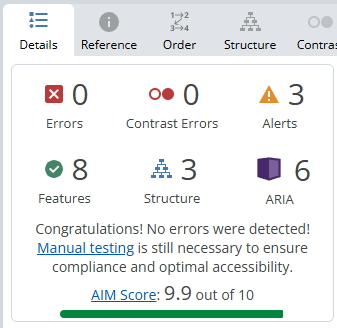 |

## Déployer un site en production
https://kasa-alpha-six.vercel.app/

## Auteur
Projet réalisé par **[Miguel LOPES]**  
Développeur full stack